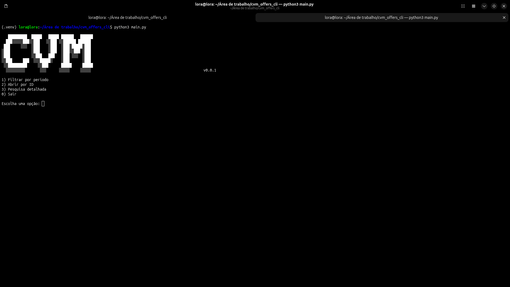
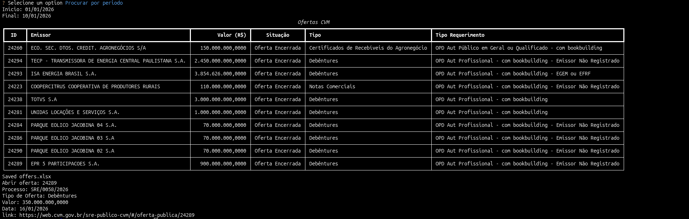
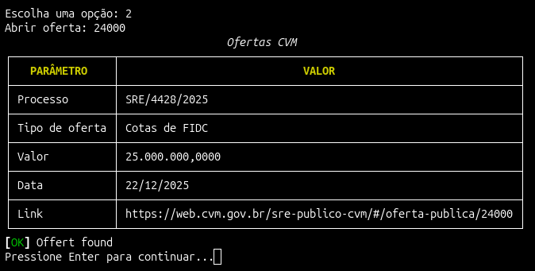
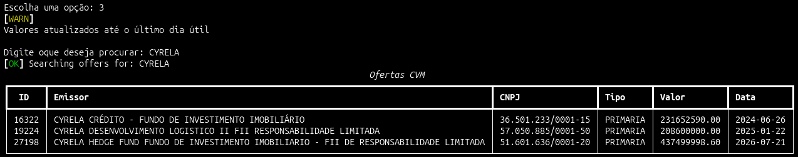

# CVM Ofertas CLI

Aplicação de linha de comando em Python para consultar **ofertas públicas registradas na CVM** (Comissão de Valores Mobiliários), com filtros por período, consulta individual por ID, visualização em tabela no terminal e exportação dos resultados para Excel.

Permite analisar ofertas desde 2022 até os dias atuais, gerando relatórios com estatísticas sobre os dados encontrados.


---

## Índice

- [Funcionalidades](#-funcionalidades)
- [Tecnologias utilizadas](#-tecnologias-utilizadas)
- [Pré-requisitos](#-pré-requisitos)
- [Instalação](#-instalação)
- [Como usar](#-como-usar)
- [Preview](#-preview)
- [Roadmap](#-roadmap)
- [Autor](#-autor)

---

## Funcionalidades

- 🔎 Consulta de ofertas por período (padrão: últimos 30 dias)
- 🆔 Consulta de oferta específica por ID
- 🖥️ Visualização dos resultados diretamente no terminal
- 📤 Exportação dos dados para Excel
- 📈 Geração de estatísticas sobre as ofertas encontradas
- 🔗 Link direto para a página da oferta no portal da CVM

## Tecnologias utilizadas

| Biblioteca | Uso |
|---|---|
| [`requests`](https://pypi.org/project/requests/) | Consumo da API/planilhas públicas da CVM |
| [`rich`](https://pypi.org/project/rich/) | Tabelas e formatação no terminal |
| [`InquirerPy`](https://pypi.org/project/InquirerPy/) | Menus e prompts interativos |
| [`openpyxl`](https://pypi.org/project/openpyxl/) | Exportação dos resultados para Excel |
| [`python-dotenv`](https://pypi.org/project/python-dotenv/) | Carregamento de variáveis de ambiente |

## Pré-requisitos

- Python 3.10 ou superior
- pip

## Instalação

```bash
# Clone o repositório
git clone https://github.com/TrajanoXT/cvm-ofertas-cli.git
cd cvm-ofertas-cli

# Crie e ative um ambiente virtual (recomendado)
python -m venv venv
source venv/bin/activate      # Linux/Mac
venv\Scripts\activate         # Windows

# Instale as dependências
pip install -r requirements.txt
```

Crie um arquivo `.env` na raiz do projeto (se necessário para sua configuração):

```env
# exemplo — ajuste conforme as variáveis que sua aplicação de fato utiliza
CVM_BASE_URL=https://www.gov.br/cvm
```

## Como usar

Execute a aplicação:

```bash
python main.py
```

O menu principal oferece três opções:

1. **Filtrar por período** — ex: `01/01/2026` a `01/02/2026`. Por padrão, o intervalo é de 30 dias.
2. **Abrir oferta por ID** — ao listar os resultados, a primeira coluna mostra o ID de cada oferta; digite o ID para abrir o link direto da oferta no portal da CVM.
3. **Pesquisa detalhada por planilha da CVM** — os valores utilizados são os do último dia útil.

## Preview

### Menu de consulta de ofertas


### Tabela de ofertas no terminal
Visualização das ofertas encontradas de acordo com a data inicial e final informadas.



### Consulta por ID
Permite informar o ID de uma oferta específica e obter seus principais dados, incluindo o link direto para a página correspondente no portal da CVM.



### Exportação para Excel
