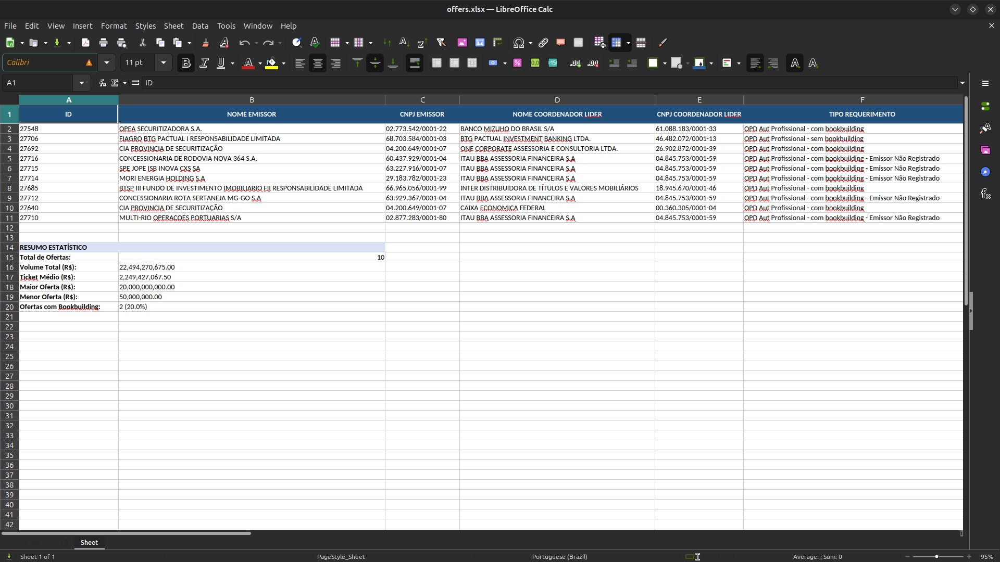
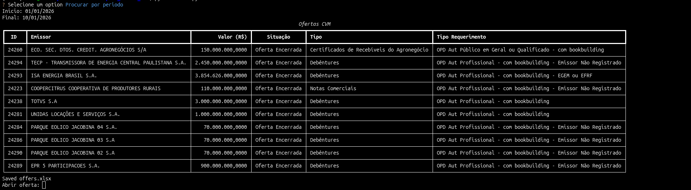

# CVM Ofertas CLI

Aplicação em Python para consultar ofertas públicas registradas na CVM, com suporte a filtros por período, consulta individual por ID e exportação dos resultados para Excel.

O projeto permite analisar ofertas desde 2022 até os dias atuais e gerar relatórios com algumas estatísticas sobre os dados encontrados.

## Funcionalidades

* Consulta de ofertas por período
* Consulta de oferta específica por ID
* Visualização dos resultados diretamente no terminal
* Exportação dos dados para Excel
* Geração de estatísticas sobre as ofertas
* Link direto para a página da oferta no portal da CVM

## Preview

### Consulta de ofertas

### Tabela no terminal

Visualização das ofertas encontradas de acordo com a data inicial e a data final informadas.

### Consulta por ID

Permite informar o ID de uma oferta específica e obter seus principais dados, incluindo o link direto para a página correspondente no portal da CVM.
